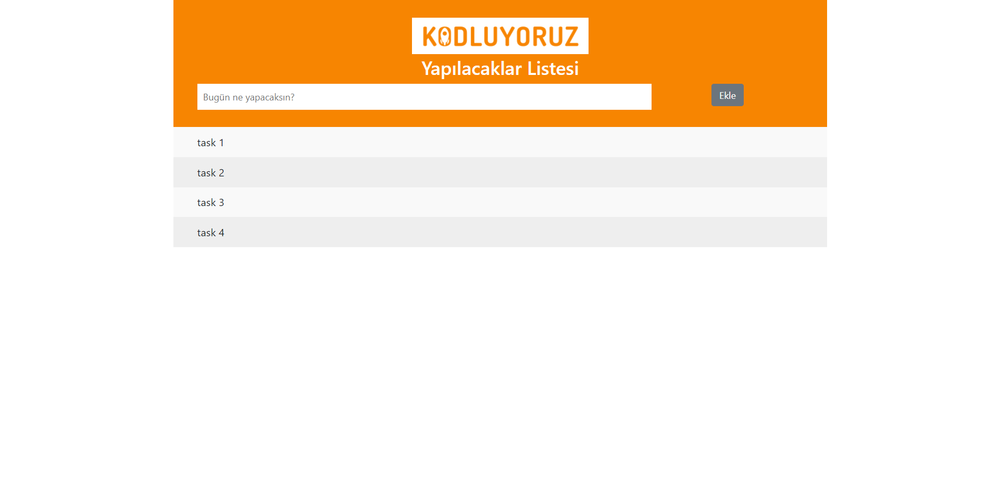

# Todo List Project

This is a simple Todo List project written in JavaScript. It allows you to add, mark as done, and remove tasks. The tasks are stored locally in the browser's localStorage, so they persist even if you close or reload the page.

## Features

- **Add Task**: Enter a task in the input field and click the "Add Task" button. The task will be added to the list.
- **Mark as Done**: Click on a task to mark it as done. The task will be visually indicated as completed.
- **Remove Task**: After marking a task as done, it will automatically be removed after 2 seconds.

## Setup

1.  Clone the repository to your local machine.
2.  Open the `index.html` file in a web browser.

## Usage

1.  Enter a task in the input field.
2.  Click the "Add Task" button to add the task to the list.
3.  Click on a task to mark it as done.
4.  Marked tasks will be automatically removed after 2 seconds.

## Code Overview

- `newTaskBtn`: Button for adding new tasks.
- `taskInput`: Input field for entering tasks.
- `taskList`: List container for displaying tasks.
- `createTodo()`: Function to create and add a new task to the list.
- `readTodos()`: Function to read tasks from localStorage and display them on page load.
- `changeTodoStatus()`: Function to toggle the status of a task (done/undone) and remove it after 2 seconds.

Feel free to use and modify this simple Todo List project as needed. Happy task managing!
